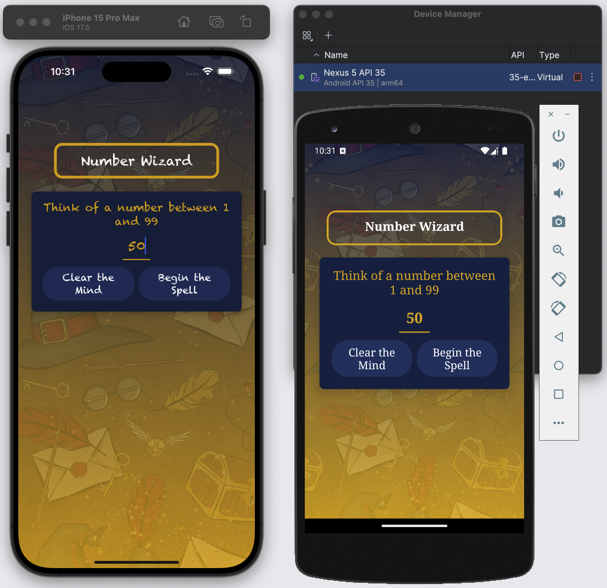
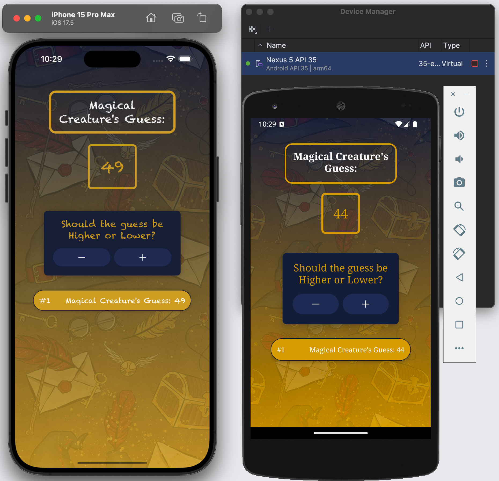
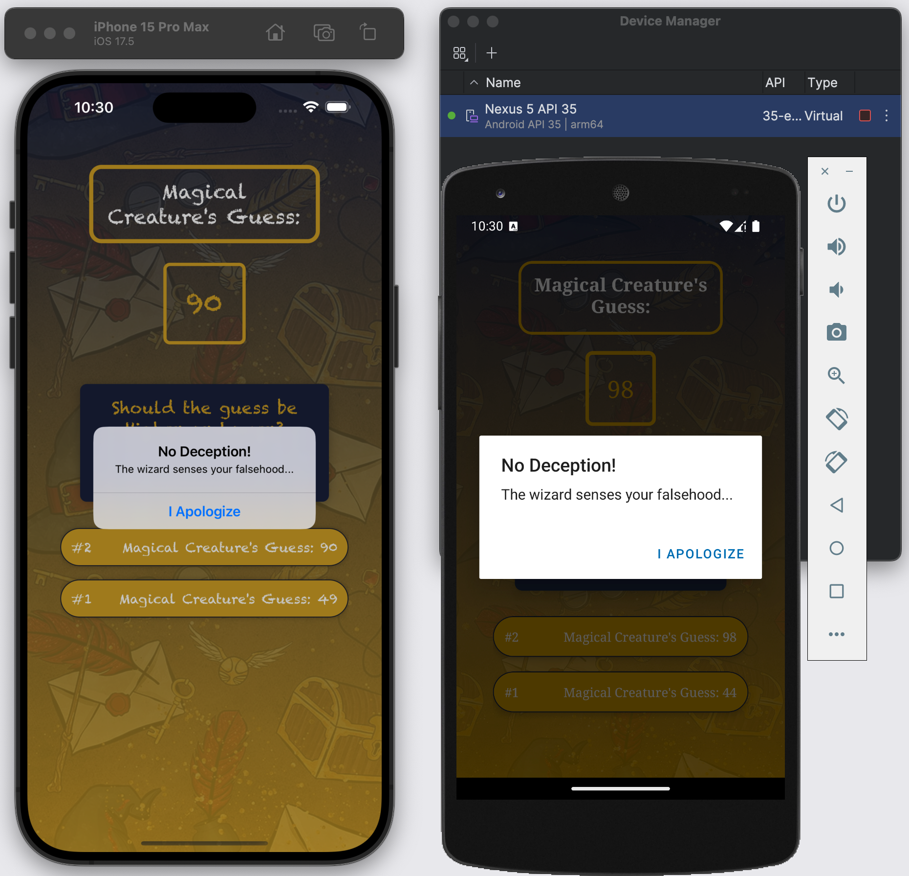
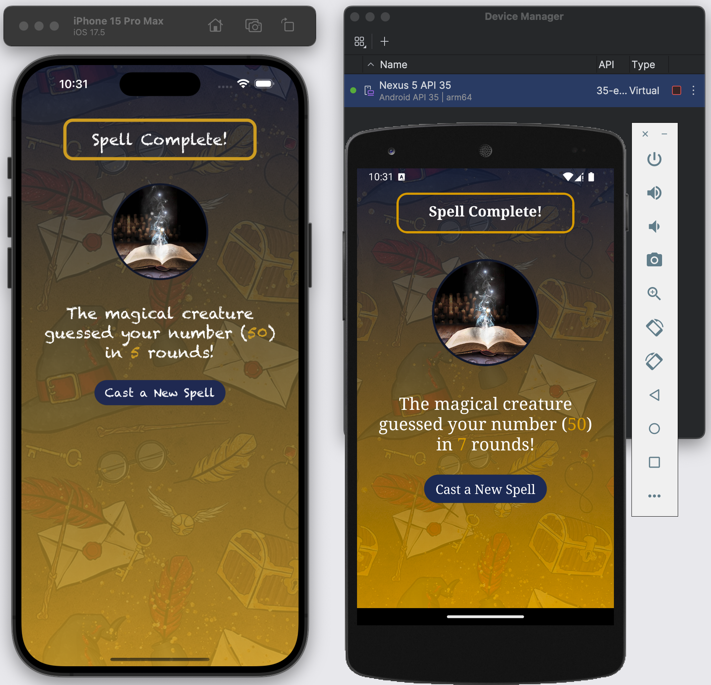
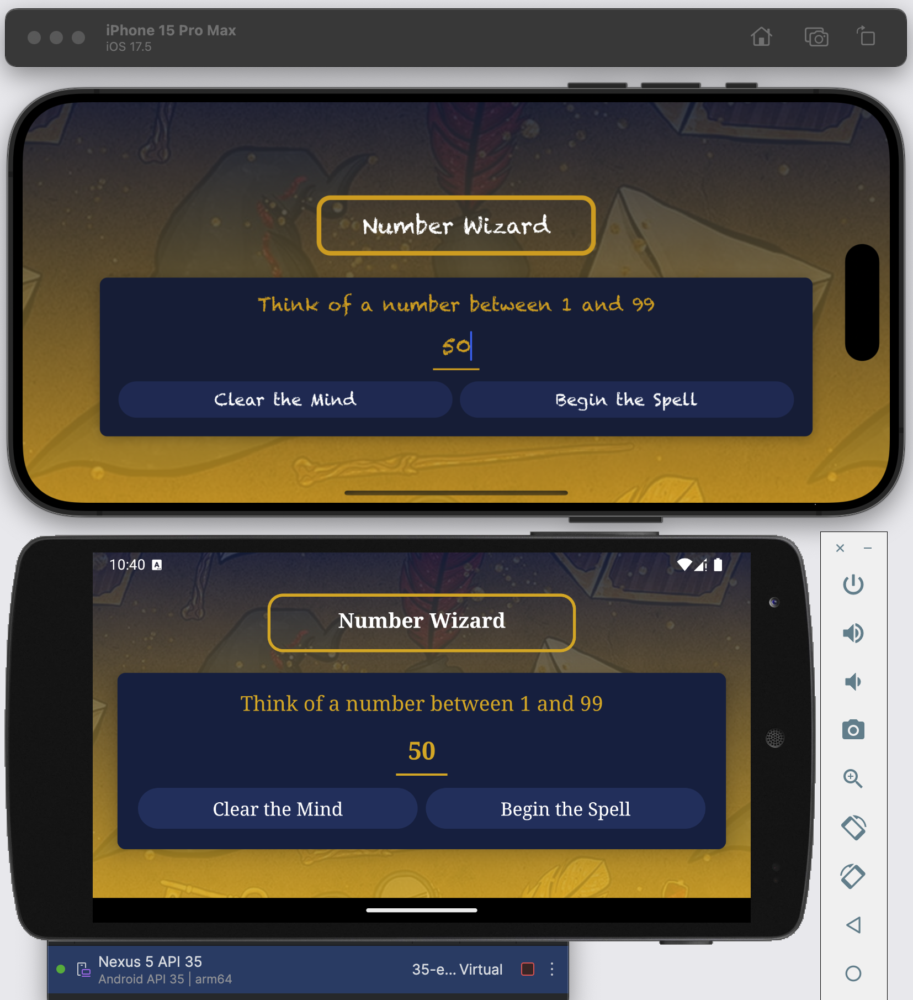
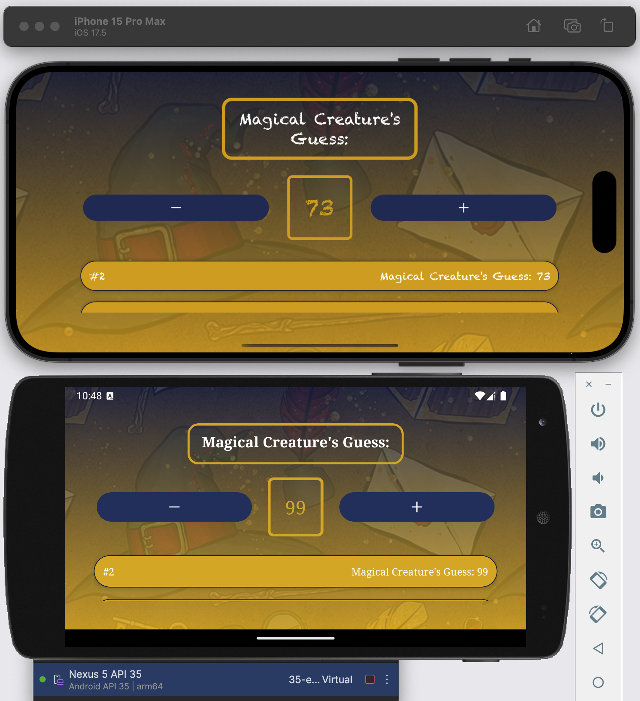
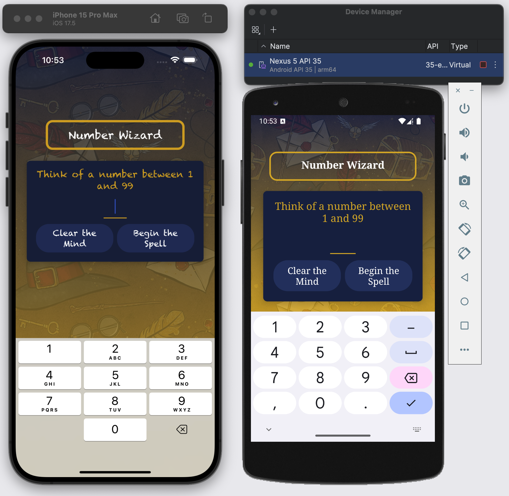

# NumberWizard

NumberWizard is a simple and engaging React Native application where users can play a number guessing game. The app guides the user through the process of picking a number between 1 and 99 and then tries to guess the number through a series of steps.

## Features

### Start Game Screen

The Start Game Screen welcomes users with a magical theme and allows them to begin their journey. Users can input a number between 1 and 99 using a custom-styled input field that limits entries to two digits. The screen offers two themed buttons: "Clear the Mind" to reset the input, and "Begin the Spell" to start the game. The entire UI is designed with a captivating magical and wizardry aesthetic to immerse players in the game's atmosphere.

---

### Game Screen

On the Game Screen, players witness the "Magical Creature" attempting to guess their chosen number. The current guess is prominently displayed in a stylized number container. Users can provide feedback using intuitive "+" and "-" buttons, indicating whether the actual number is higher or lower. The game keeps track of all previous guesses and displays them, adding to the challenge. To maintain fair play, the game incorporates logic to prevent user deception, ensuring an honest and engaging experience.

Current Guess:

---

Prevent User Deception:

---

### Game Over Screen

Upon successful completion, players are greeted with a "Spell Complete!" message on the Game Over Screen. This screen provides a summary of the game, revealing the user's chosen number and the number of rounds it took to guess correctly. A thematic success image celebrates the accomplishment, and players can choose to "Cast a New Spell" to start another game, encouraging replayability.

### Dynamic Styling and Responsive Design

The app features dynamic styling that adapts the UI based on screen size and orientation. It implements different layouts for portrait and landscape modes, ensuring an optimal viewing experience across various devices. Font sizes and spacing are responsive, adjusting to provide the best readability and usability regardless of the screen dimensions.

Landscape Mode:

---

### Custom Components

Number Wizard utilizes several custom components to enhance its unique look and feel. These include a reusable and animated `PrimaryButton`, a themed `Title` component with platform-specific styling, a `Card` component for consistent styling of content containers, custom `InstructionText` for clear guidance, a styled `NumberContainer` for number display, and `GuessLogItem` for presenting each entry in the game log.

---

### Platform-Specific Styling

The app takes advantage of platform-specific features to provide a native feel on both iOS and Android. It uses the Chalkduster font on iOS and Serif font on Android, along with other platform-specific UI element styling to ensure the game looks and feels appropriate on each operating system.

Platform Specific Font Family:

### Accessibility and User Experience

To enhance accessibility and user experience, the app implements `KeyboardAvoidingView` for improved keyboard interaction and uses `ScrollView` to ensure all content is accessible on smaller screens. These features contribute to a smooth and frustration-free gaming experience for all users.

Keyboard Avoiding View:

### Error Handling

Robust error handling is implemented throughout the app. It includes input validation with user-friendly error messages and utilizes the Alert component to display clear warnings for invalid inputs, guiding users to correct their actions without disrupting the game flow.

### State Management and Performance

The app leverages React hooks for efficient state management, ensuring smooth transitions and updates throughout the game. For performance optimization, particularly in longer games, it uses `FlatList` to render the list of guesses, providing a smooth scrolling experience even with an extensive guess history.

## Installation

To install and run the NumberWizard app on a simulator, follow these steps:

### iOS

1. Download the iOS build file from [this link](https://expo.dev/accounts/abbiecheng236/projects/NumberWizard/builds/ea54c933-5040-45c1-bab4-a648c5e12214).
2. Open Xcode on your Mac.
3. Choose your preferred iOS simulator.
4. Drag and drop the downloaded .app file onto the simulator window.
5. The app should install and launch automatically.

### Android

1. Download the Android build file (.apk) from [this link](https://expo.dev/accounts/abbiecheng236/projects/NumberWizard/builds/1ff1a078-e768-47d3-93e1-b992a1b14a4d).
2. Open Android Studio on your computer.
3. Start your preferred Android emulator.
4. Drag and drop the downloaded .apk file onto the emulator window.
5. The app should install and launch automatically.

## How to Play

1. Launch the NumberWizard app.
2. Think of a number between 1 and 99.
3. Enter your chosen number on the start screen.
4. The magical creature will try to guess your number.
5. Use the "+" and "-" buttons to guide the creature's guesses.
6. Continue until the creature guesses your number correctly.
7. View your game summary on the game over screen.
8. Start a new game to play again!

## Technologies Used

- React Native
- Expo
- React Hooks (useState, useEffect)
- Custom components
- Responsive design with Dimensions API
- Platform-specific styling

## Feedback and Contributions

If you encounter any issues or have suggestions for improvements, please feel free to open an issue or submit a pull request on the project's GitHub repository.

Enjoy playing NumberWizard!
